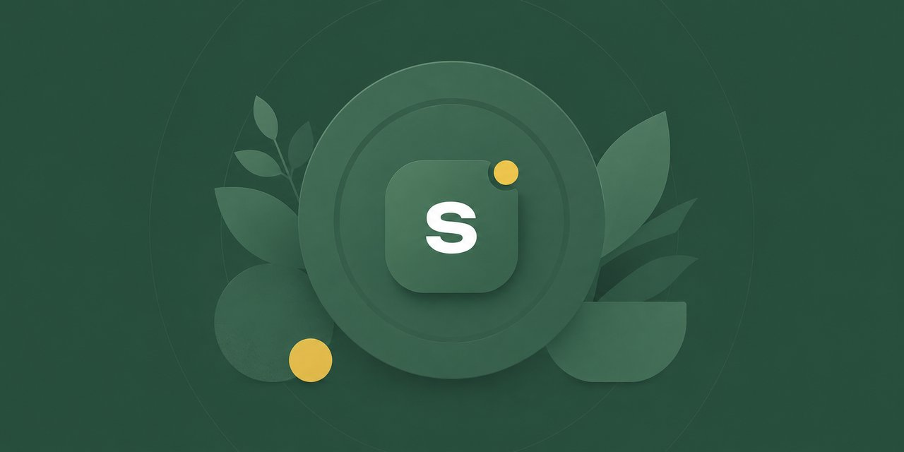
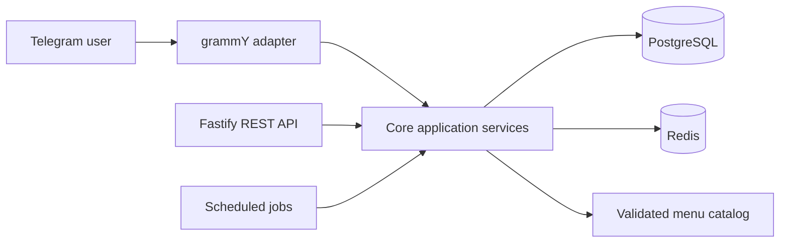

  

<h1 align="center">Strunki</h1>

  <strong>API-first Telegram nutrition bot with personalized plans, progress tracking, and subscriptions</strong>

  
  
  

> This is a public engineering case study. The actively developed product source code remains private.

## Product overview

Strunki is a Ukrainian Telegram bot that turns a guided onboarding flow into a structured nutrition plan.

It calculates calorie and macro targets, selects a suitable menu, presents daily meals, tracks progress, schedules reminders, and manages trial or paid access through Telegram Stars.

The product separates Telegram interaction from reusable application services. Core functionality is also available through a Fastify API instead of being embedded only inside bot handlers.

<table>
  <tr>
    <td></td>
    <td></td>
    <td></td>
  </tr>
</table>

## Core capabilities

- Guided onboarding and user-profile collection
- Calorie and macro calculations
- Configurable nutrition goals
- Menu selection by diet style and calorie band
- Seven-day menu catalog
- Weight check-ins and progress history
- Scheduled coaching and reminders
- Trial and subscription access
- Telegram Stars payments
- Nutritionist Q&A
- Ukrainian localization

## High-level architecture

### API-first boundary

Telegram handlers translate messages and callbacks into calls to core application services. Business rules remain reusable and are also exposed through REST routes.

### Data and state

PostgreSQL and Prisma store application data and version schema changes through migrations. Redis persists multi-step conversation state outside the bot process.

## Quality and operations

- Strict TypeScript configuration
- Fastify health and readiness endpoints
- PostgreSQL and Redis service checks
- Docker Compose environments
- GitHub Actions typecheck, test, and delivery workflow
- Long-polling and webhook operating modes
- Scheduled background jobs

## Testing

The current codebase passes:

- **79 test files**
- **676 automated tests**
- **TypeScript typecheck**

Tests cover core services, API routes, bot routing, onboarding transitions, subscriptions, scheduled jobs, catalog validation, progress flows, Redis storage, and architectural boundaries.

## Technology stack

| Area | Technologies |
| --- | --- |
| Runtime | TypeScript, Node.js |
| API | Fastify, REST APIs |
| Telegram | grammY, Telegram Bot API |
| Data | PostgreSQL, Prisma |
| State | Redis |
| Payments | Telegram Stars |
| Testing | Vitest |
| Delivery | Docker Compose, GitHub Actions, Linux |

## My responsibilities

I designed and built Strunki as an independent product, including:

- Product flow and application architecture
- Core services and REST API
- Telegram interaction layer
- PostgreSQL schema and migrations
- Redis-backed conversation state
- Subscription and scheduled-job workflows
- Automated tests
- Docker and deployment configuration

## Why the source is private

Strunki is an actively developed product. This repository documents the product and engineering work without publishing proprietary implementation details.

I can demonstrate the live bot and discuss architecture, schema design, testing strategy, and selected sanitized code during an interview.

## Links

- **Live bot:** https://t.me/strunki_menu_bot
- **LinkedIn:** https://www.linkedin.com/in/volodymyr-tomash
- **Developer:** [Volodymyr Tomash](https://github.com/TomashVolodymyr)
